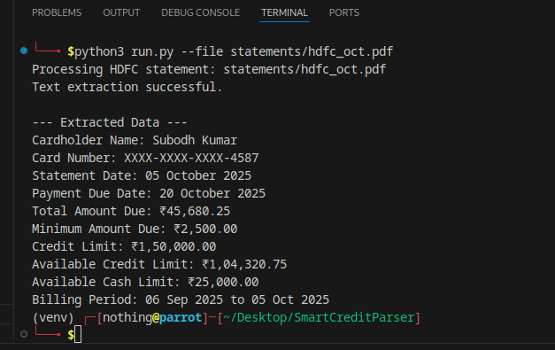

Credit Card Statement Parser (HDFC)
How to Run

Follow the steps below to set up and execute the Credit Card Statement Parser project.

Step 1: Create and activate a virtual environment
python3 -m venv venv
source venv/bin/activate        # For Linux or macOS
venv\Scripts\activate           # For Windows

Step 2: Install all required dependencies
pip install -r requirements.txt

Step 3: Add your HDFC statement

Place the credit card statement (PDF file) inside the statements/ folder.
For example:

statements/hdfc_oct.pdf

Step 4: Run the parser

Execute the following command:

python3 run.py --file statements/hdfc_oct.pdf

Step 5: View the output

After running the command, the extracted data will be displayed in the terminal in JSON format, for example:

{
    "Bank": "HDFC Bank",
    "Cardholder Name": "Rohit Sharma",
    "Last 4 Digits": "1234",
    "Billing Cycle": "01/10/2024 to 31/10/2024",
    "Payment Due Date": "10/11/2024",
    "Total Amount Due": "₹45,672.80"
}

A detailed log file named parser.log is generated automatically.
You can also view saved extraction results in the output/ folder.

Project Overview

This project is designed to extract essential information from HDFC Bank credit card statements in PDF format. It demonstrates text extraction, parsing logic, and data normalization using Python. The system is built to handle real-world PDF layouts and extract key financial details accurately.

Objective

To build an automated PDF parser that extracts specific data points from credit card statements with a focus on HDFC Bank.
The project serves as a prototype for a larger multi-bank parser system.

Key Features

Extracts key financial data from HDFC credit card statements.

Utilizes pdfplumber for reliable PDF text extraction.

Automatically handles non-searchable (image-based) PDFs using OCR fallback via Tesseract.

Generates structured and normalized output in JSON format.

Maintains detailed logs for debugging and tracking extraction performance.

Extracted Data Points

The following five key data points are extracted from each statement:

Cardholder Name

Last Four Digits of the Card

Billing Cycle

Payment Due Date

Total Amount Due

Project Structure
SmartCreditParser/
├── statements/                # Folder to store PDF statements
├── output/                    # Folder for parsed outputs
├── src/
│   ├── extractor.py           # Handles PDF and OCR text extraction
│   ├── bank_parsers.py        # Contains logic for parsing HDFC statements
│   ├── normalizer.py          # Normalizes extracted data
│   ├── runner.py              # Main controller for parsing workflow
│   ├── utils.py               # Helper functions and logging utilities
│   └── __init__.py
├── tests/                     # Optional unit tests
├── parser.log                 # Log file for parser operations
├── README.md                  # Project documentation
├── requirements.txt           # Required Python dependencies
└── run.py                     # Entry point for the project

Technologies Used

Python 3.11

pdfplumber for PDF text extraction

pytesseract and pdf2image for OCR fallback

pandas for data handling

jinja2 for report generation (optional)

Evaluation Criteria

This project will be evaluated based on:

Functionality and accuracy of extracted data

Code readability and implementation quality

Proper documentation and ease of demonstration

Future Enhancements

Extend support to additional credit card providers such as ICICI, SBI, Axis, Kotak, and American Express.

Integrate machine learning for automatic template detection.

Add a graphical dashboard for visualizing monthly spending trends.